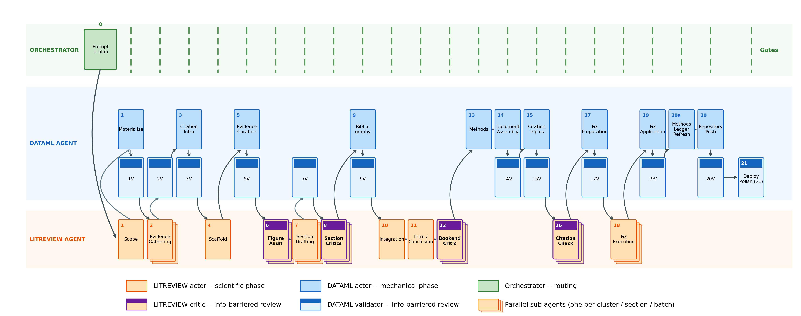

# The Ethical Debt

[](https://doi.org/10.5281/zenodo.21213212)

Computational critical review of why wasting animal data is wasting animal lives, produced with the Expert Review Pipeline v29 and published as an interactive MyST site.

## Pipeline Overview



The pipeline executes 21 phases with **actor-critic separation** — 20 production phases (scoping through repository push) followed by Phase 21 deploy-polish, a post-deployment UX gate — section writers cannot see how they will be critiqued, figure auditors cannot see the argument arc, and citation verifiers cannot see the fix protocol. This prevents agents from gaming evaluation criteria.

## Local build

```bash
npm install
node scripts/validate-trust.js
node scripts/test-trust-validator.js
node --test tests/*.test.mjs
npx myst build --html
```

GitHub Actions runs the same TRUST validation and tests before deploying the MyST site to GitHub Pages.

## TRUST v2 knowledge layer

The review contains 510 prose-anchored claim records scored with TRUST rubric v2.0.0. Every `trust-claim` directive resolves to a deterministic graph record; its interactive MyST card exposes the overall band, all five component rules and rationales, verified source passages, atom-level citation attribution, scope judgments, and mandatory caps. Hover and keyboard focus also highlight the exact prose being assessed.

- `knowledge/claim_graph.json` is the canonical claim and citation-context graph.
- `knowledge/claim_index.json` and `knowledge/trust_score_report.json` are derived validator-owned views.
- `content/trust_summary.md` provides review-level and section-level rollups.
- `knowledge/trust_v1_to_v2_id_map.json` records the deterministic legacy-ID migration.

Run `node scripts/migrate-trust-v2.js` only when regenerating the v2 artifacts and directives from the preserved legacy material; then run the validation commands above. The earlier Python TRUST scripts remain historical pipeline artifacts and must not be used to overwrite the v2 graph.

## What's Included

### Skills (20 files in `skills/`)

The pipeline is split into role-specific skills with **information barriers** to enforce actor-critic separation. Worker skills produce content; validator skills run after each phase as blinded gates that emit named pass/fail checks into the gate JSON.

**Worker skills (13):**

| Skill | Phase | Role | Barrier |
|-------|-------|------|---------|
| `comprev-orchestrator-v29` | All | Coordinator | Sees everything |
| `comprev-scoping` | 1 | LITREVIEW | No barriers (first phase, sees user prompt) |
| `comprev-evidence-gathering` | 2 | LITREVIEW | Cannot see critic/writing criteria |
| `comprev-scaffold` | 4 | LITREVIEW | Cannot see critic criteria |
| `comprev-figure-audit` | 6 | LITREVIEW | Blinded — no scaffold or argument arc |
| `comprev-section-writing` | 7 | LITREVIEW | Cannot see critic criteria |
| `comprev-critic` | 8, 12 | LITREVIEW | Blinded — no scaffold or writing template |
| `comprev-integration` | 10–11 | LITREVIEW | Full visibility (integration role) |
| `comprev-verification` | 15–17 | LITREVIEW | Cannot see fix protocol |
| `comprev-fix-execution` | 18 | LITREVIEW | Cannot see verification criteria |
| `comprev-dataml-phases` | 1, 3, 5, 9, 13–15, 17, 19–20 | DATAML | No barriers (mechanical work) |
| `comprev-reviewer-agent` | 2, 4, 6–8, 10–12, 16, 18 | LITREVIEW | Evidence & writing procedures |
| `comprev-figure-construction` | 7 | LITREVIEW | Figure production |

**Validator skills (7):**

| Skill | Phase | Role | What it gates |
|-------|-------|------|---------------|
| `comprev-scoping-validator` | 1V | DATAML | Scope JSON, evidence-parameters consistency, plan structure, prompt-verbatim provenance |
| `comprev-evidence-validator` | 2V | DATAML | Evidence-package schema, per-cluster coverage, fulltext rate |
| `comprev-curation-validator` | 5V | DATAML | Per-section evidence package size, conflict and figure-data presence |
| `comprev-citation-validator` | 3V, 9V | DATAML | citation_key_map (Phase 3) and BibTeX (Phase 9) — DOI resolution, CrossRef matching, key uniqueness, author match |
| `comprev-triples-validator` | 15V | DATAML | One triple per `{cite:p}`/`{cite:t}` occurrence, no sampling |
| `comprev-myst-validator` | 7V, 14V, 19V, 20V | DATAML | MyST build, structural checks, figure/heading consistency, plugin-directive invocation, evidence-package population, directive whitelist (7V/19V), repo-wide forbidden-lexicon glob (19V), author-identity placeholder check (20V) |
| `comprev-deploy-polish` | 21 | DATAML | Post-deployment UX gate: tier-A static checks against built Pages-artifact tarball; tier-B live-URL checks (per-page HTTP, external link health) with manual-checklist fallback when deploy URL is sandbox-inaccessible |

### Plugins (4 files in `plugins/`)

| Plugin | What it does |
|--------|-------------|
| `authorship-plugin.mjs` | Renders interactive CRediT authorship widget |
| `evidence-explorer-plugin.mjs` | Loads evidence packages into interactive browser |
| `figure-lightbox-plugin.mjs` | Click-to-zoom lightbox for inline figures |
| `trust-claim-plugin.mjs` | Resolves enriched TRUST v2 records and mounts interactive claim cards |

### Review content (`content/`)

Published review pages and supporting views:
- `00_frontmatter.md` — Abstract + authorship explorer
- `01_introduction.md` through `09_conclusion.md` — The complete review
- `trust_summary.md` — TRUST v2 score rollups and review priorities
- `Methods.md` — Methods and pipeline figure
- `evidence_database.md` — Interactive evidence explorer
- `provenance.md` — Pipeline execution summary

### Site infrastructure

- `myst.yml` — MyST project, table of contents, plugins, and site configuration
- `.github/workflows/deploy.yml` — Auto-builds MyST site and deploys to GitHub Pages
- `scripts/shared_style.py` — Common figure style (colors, fonts, 300 DPI)
- `content/authors.yml` — Author metadata for the authorship widget (extended into `myst.yml`)

## Pipeline Architecture

**Act 1 — Evidence & Infrastructure** (Phases 1–6): Define scope, gather evidence from literature databases (PubMed, OpenAlex, bioRxiv), build citation infrastructure from CrossRef, construct the review scaffold, curate per-section evidence packages, and audit figure comparisons for methodological validity.

**Act 2 — Drafting & Criticism** (Phases 7–13): Draft sections in parallel (max 4 agents), run blinded 6-track criticism, build bibliography from CrossRef, perform 6-pass integration for consistency, write introduction/conclusion/abstract, run blinded bookend critic on intro/conclusion, and generate the methods section.

**Act 3 — Assembly, Verification & Deploy** (Phases 14–20): Assemble the complete document, exhaustively extract citation triples (every citation occurrence), verify ALL citations with full-text-first claim checking (DOI resolution, title/author/metadata match, full-text claim verification with supporting passage audit trail), prepare and execute fixes for non-verified citations, apply fixes, and push to GitHub.

**Act 4 — Deploy Polish** (Phase 21): Post-deployment UX gate. Tier-A static checks (forbidden lexicon, author identity, directive rendering, frontmatter leak, figure dropdown completeness, asset paths, plugin data binding, internal link health) run against the built Pages-artifact tarball downloaded via the GitHub API — works on private repositories. Tier-B live-URL checks (per-page HTTP, external link health) downshift to a user-runnable manual checklist when the deployed site is unreachable from the validator sandbox.

### Evidence Parameters

The pipeline's evidence-gathering depth is user-configurable via the prompt. Phase 1 extracts these from your review request:

| Parameter | Default | What it controls |
|-----------|---------|-----------------|
| `min_papers_per_cluster` | 70 | Minimum unique papers per topic cluster |
| `saturation_criterion` | null | Optional stopping rule (e.g., "<2% new unique in last 100") |
| `snowball_rounds` | 0 | Citation-chasing rounds via OpenAlex (forward + backward) |
| `total_bibliography_target` | null | Optional floor for total bibliography across all clusters |

**Saturation mode:** Say "saturate the literature" in your prompt — the pipeline sets `min_papers_per_cluster: null`, `saturation_criterion: "<2% new unique in last 100"`, `snowball_rounds: 2`, and searches until the field is exhausted.

**Quota mode:** Say "≥200 papers per section" — the pipeline gathers at least 200 per cluster via keyword search without snowballing.

**Both:** Specify a floor AND a saturation criterion — the agent must meet the floor AND confirm saturation.

Phase 5 curation floors scale proportionally with your evidence density target.

### Key Design Principles

- **Mechanical citation infrastructure**: All citation keys and author names come from CrossRef API — never from LLM memory. This prevents hallucinated references.
- **Actor-critic separation**: Writers don't know how critics will evaluate them. Critics don't know the intended argument. This prevents gaming.
- **Incremental artifact saves**: Agents save intermediate work before expensive operations. If an agent crashes, partial work survives.
- **Max 4 parallel agents**: Prevents system resource exhaustion from too many simultaneous heavy agents.
- **Gate checkpoints**: Each phase transition requires a named gate artifact. The coordinator verifies compliance before advancing.
- **Full-text citation verification**: Every citation-claim pair is verified against the cited paper's full text (not just abstract). VERIFIED status requires a verbatim supporting passage from the paper. This catches interpretive mismatches where the abstract is topically compatible but the paper's findings contradict the review's claim.

## Customization

- **Title and metadata**: Edit `myst.yml` project title, description, and keywords
- **Authors**: Edit `content/authors.yml` to add human contributors alongside the AI author
- **Figure style**: Edit `scripts/shared_style.py` to change colors, fonts, and figure aesthetics
- **Navigation**: The top bar (Review | Methods | Evidence | Provenance | GitHub) is configured in `myst.yml` site.nav

## License

MIT

## How to Cite

If you use this template in your research, please cite:

```bibtex
@software{lecoq_2026_21213212,
  author       = {Jérôme Lecoq},
  title        = {AllenNeuralDynamics/ComputationalReviewTemplate},
  year         = 2026,
  publisher    = {Zenodo},
  doi          = {10.5281/zenodo.21213212},
  url          = {https://doi.org/10.5281/zenodo.21213212}
}
```

> Lecoq, J. (2026). *AllenNeuralDynamics/ComputationalReviewTemplate* (v1.0.0). Zenodo. https://doi.org/10.5281/zenodo.21213212

