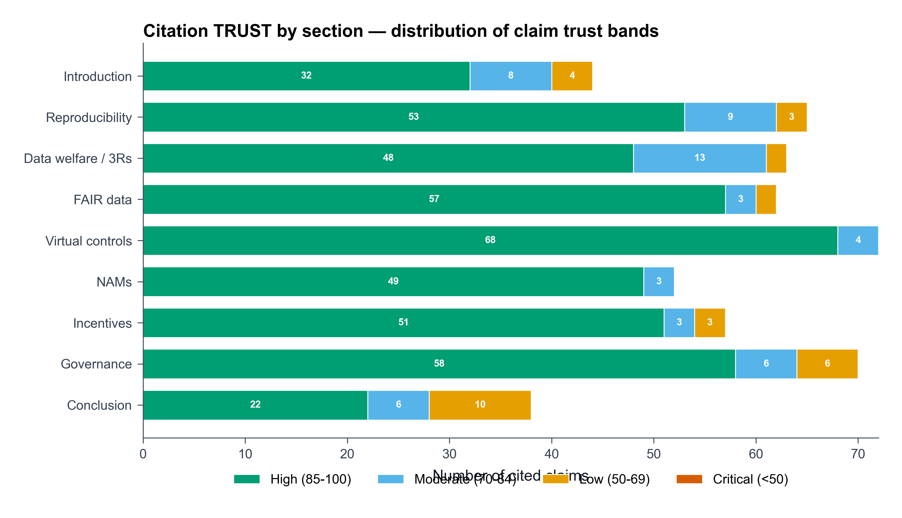
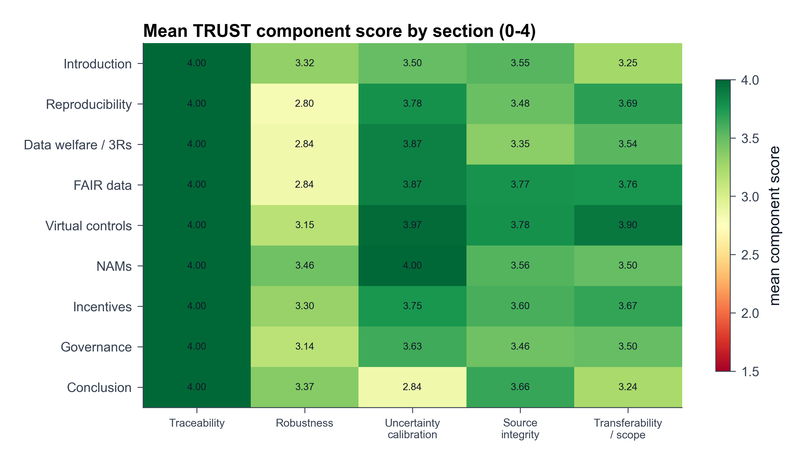
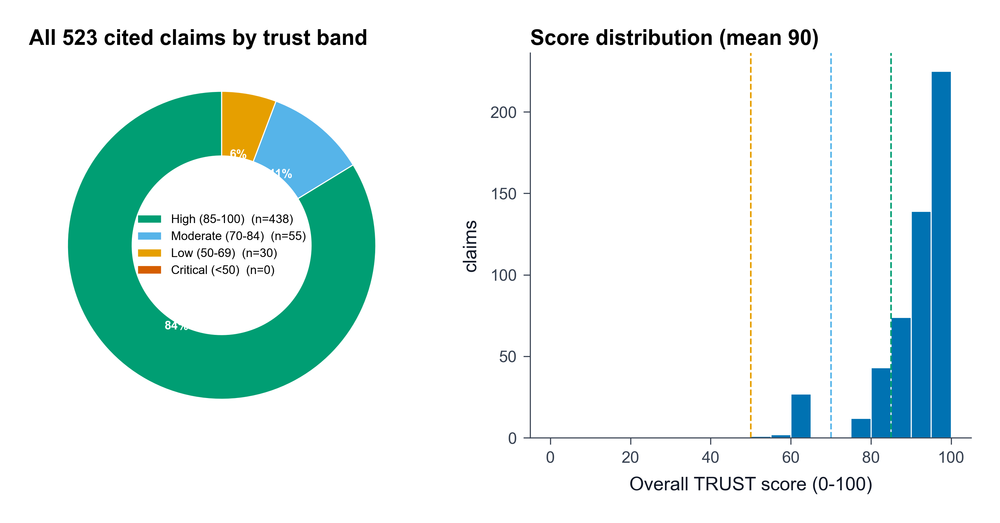

(sec-trust-summary)=
# Citation Trust Summary

This review exposes **523 claim-level TRUST records** using rubric v2.0.0. Hovering or focusing a score highlights the concerned prose; opening the card reveals all five component rules, rationales, verified source passages, atom attribution, scope status, and cap reasons.

The mean overall score is **89.5**. Band distribution: **high 438 · moderate 55 · low 30 · critical 0**. **30** claims trigger a mandatory cap, and **30** remain explicit human-review priorities.

## Component means (0–4)

| Traceability | Robustness | Uncertainty calibration | Source integrity | Transferability / scope |
|---:|---:|---:|---:|---:|
| 4.00 | 3.11 | 3.74 | 3.58 | 3.59 |

## Per-section rollup

| Section | Claims | Mean | High | Moderate | Low | Critical |
|---|---:|---:|---:|---:|---:|---:|
| Introduction | 44 | 87.5 | 32 | 8 | 4 | 0 |
| Reproducibility | 65 | 88.3 | 53 | 9 | 3 | 0 |
| Data welfare / 3Rs | 63 | 87.5 | 48 | 13 | 2 | 0 |
| FAIR data | 62 | 91.0 | 57 | 3 | 2 | 0 |
| Virtual controls | 72 | 94.0 | 68 | 4 | 0 | 0 |
| NAMs | 52 | 92.6 | 49 | 3 | 0 | 0 |
| Incentives | 57 | 91.1 | 51 | 3 | 3 | 0 |
| Governance | 70 | 87.9 | 58 | 6 | 6 | 0 |
| Conclusion | 38 | 82.6 | 22 | 6 | 10 | 0 |

## Lowest-trust claims (review priority)

| Score | Band | Section | Claim | Cap |
|---:|---|---|---|---|
| 50 | low trust | Incentives | The pattern generalises across national systems — in Ecuador, reliance on journal-centric metrics predicted lower adoption of open practices while institutional deposit mandates and data services predicted higher adoption. | overextended_scope |
| 55 | low trust | Introduction | The empirical anchor the review returns to most often — that actual, usable data availability sits near two percent while declared availability and paperwork compliance sit far above it — recurs across FAIR audits, incentive studies, and governance evaluations alike, and it is against that near-static baseline — the empirical ~2% availability anchor — that every enforcement result must be judged. | overextended_scope |
| 55 | low trust | Introduction | The strongest version of that claim is also its simplest, and it is the thread that ties the sections together: because animals have already paid for the data with their welfare and, usually, their lives, letting the data go to waste is not merely poor science but a welfare harm in its own right, and repaying the debt — through FAIR stewardship, through reuse and virtual control groups, through disciplined stewardship of the data that non-animal methods generate, and through incentive and governance reform that makes stewardship count — is a way of saving animals. | overextended_scope |
| 60 | low trust | Introduction | Concordance between virtual and concurrent controls is endpoint-dependent, with high agreement for categorical decisions such as dose-limiting toxicities and substantial non-reproducibility for continuous clinical-pathology parameters; historical data drift over time and across laboratories, with study year emerging as the single most influential covariate in one large multi-company database; and, decisively, no regulator has yet accepted a virtual-control-group study in place of a concurrent control for a pivotal preclinical submission. | contradicted_without_caveat |
| 60 | low trust | Introduction | A structural model argues that as long as publication drives careers, methods that produce more publishable results will keep being selected for regardless of their reliability, against a reform manifesto that expects methods, reporting, and incentive measures to improve reliability if adopted across the system. | contradicted_without_caveat |
| 60 | low trust | Reproducibility | Their value is not their precision but their convergence with a theoretical prior — that under realistic assumptions about power, bias, and pre-study odds, a research claim in most fields is more likely false than true. | contradicted_without_caveat |
| 60 | low trust | Reproducibility | Opinion surveys of laboratory-animal researchers put the published fraction low: staff at not-for-profit institutes estimated that only half of conducted animal experiments are published, and those in for-profit settings estimated just 10%. | contradicted_without_caveat |
| 60 | low trust | Reproducibility | That contrast, laid out in, is the section's sharpest illustration of a general vulnerability: when a defensible analytic choice can flip a model from "poorly mimics" to "greatly mimics" human disease, the conclusion on translatability is being decided by analytic degrees of freedom rather than by the animals. | contradicted_without_caveat |
| 60 | low trust | Data welfare / 3Rs | On cumulative harm, a fifteen-year database of blood markers from thirty-nine rhesus monkeys found no support for long-term cumulative effects of implants, fluid control, and repeated procedures, and is offered as a reassuring reference for severity assessment; against this, telomere attrition is proposed as an objective, dose-dependent molecular record of an animal's lifetime negative experience — a biomarker that would, by construction, register cumulative wear that conventional blood markers miss. | contradicted_without_caveat |
| 60 | low trust | Data welfare / 3Rs | On acute severity, the standard instrument fares no better unaided: in a rat liver-cirrhosis surgery model the usual welfare score-sheet parameters were insufficient to predict death until the cut-offs were retrospectively re-optimised, whereas an evidence-based behavioural and biochemical analysis of electrical kindling concluded that a simple welfare measure was a valid basis for grading severity. | contradicted_without_caveat |
| 60 | low trust | FAIR data | The same gap between a standard's promise and its semantic reach recurs at the level of metadata registries: the ISO/IEC 11179 model is presented as automatically conferring FAIR adherence across findability, interoperability, and reusability, yet a variable-level harmonisation effort across cardiovascular cohorts found that it supplies only a general registry framework and lacks the formal semantic relationships needed to align variables across studies. | contradicted_without_caveat |
| 60 | low trust | FAIR data | Mapping to the OMOP common data model repeatedly loses domain content: standard OMOP vocabularies could directly represent only a quarter (19 of 75) of core extracorporeal-life-support concepts, a scoping review found OMOP vocabularies lack the granularity to capture oncology concepts and care episodes, and deep phenotyping of a rare skin disease mapped only 13,485 of 33,347 extracted phenotypes to a standard concept, leaving nearly twenty thousand unmapped. | contradicted_without_caveat |
| 60 | low trust | Incentives | An incentivised psychology survey concluded that some practices are so widely admitted that they may constitute the prevailing research norm, whereas the larger cross-national study argued that widespread one-time involvement does not amount to systematic use once the frequency of any given practice is measured. | contradicted_without_caveat |
| 60 | low trust | Incentives | Text-mining across disciplines concluded that p-hacking, though common, only weakly perturbs meta-analytic consensus relative to the real effects being measured, whereas the theoretical framework that most published research findings are false holds that bias and flexibility make it more likely than not that a given claim is untrue. | contradicted_without_caveat |
| 60 | low trust | Governance | An observational study of a checklist that Nature journals instead mandated at revision found that the proportion of in vivo papers meeting all four "Landis" bias-reduction criteria rose from 0% to 16.4%, with no change in matched control journals. | contradicted_without_caveat |
| 60 | low trust | Governance | A randomised trial requesting ARRIVE-checklist completion at submission found that no manuscript in either group achieved full compliance, whereas an observational study of a checklist mandated at the revision stage found that reporting of bias-reduction items improved to a level "not previously observed". | contradicted_without_caveat |
| 60 | low trust | Governance | Publishing and endorsing ARRIVE produced no significant reporting gain in the Chagas literature (51% → 66%, p=0.26), while implementing a checklist at one journal produced a three-fold-greater improvement than at a matched journal without one. | contradicted_without_caveat |
| 60 | low trust | Governance | Non-publication remains the root waste: laboratory-animal researchers themselves estimate only about half of animal experiments are ever published. | contradicted_without_caveat |
| 60 | low trust | Governance | One proposal presumes review bodies can and should assess research rigor and expected benefit through a structured benefit-assessment instrument, while an analysis of US committees argues they structurally lack the expertise and mandate to judge scientific merit, so their approval carries no such warranty. | contradicted_without_caveat |
| 60 | low trust | Governance | First, enforcement over endorsement: guidelines must be gated at revision and checked, because passively published standards demonstrably do not move behaviour. | contradicted_without_caveat |
| 60 | low trust | Conclusion | Even where the animal data are not in dispute, a defensible change in analysis can flip a model from mimicking human disease to failing to, so that translatability is decided by analytic choices as much as by biology. | contradicted_without_caveat |
| 60 | low trust | Conclusion | The data that would let this record be checked or reused are largely absent — only about half of animal experiments are ever published, and only around 2% of medical papers actually share their data against the roughly 8% that declare they do. | contradicted_without_caveat |
| 60 | low trust | Conclusion | Unusable data are therefore not a downstream inconvenience but a driver of new animal use, and the loop tightens itself: the same reward structure that discourages complete reporting also produces the underpowered, unblinded studies whose results will not replicate, so the field runs experiments it cannot trust and then cannot reuse the animals' data to run better ones. | contradicted_without_caveat |
| 60 | low trust | Conclusion | Virtual control groups interrupt the loop at the most concrete point available, reusing curated control-animal data so that a group of animals never enters the next study; found a stable Reduction estimate of roughly a quarter of control animals and an infrastructure that already exists at scale, but a dividend conditional on endpoint-specific concordance and still unaccepted by any regulator for a pivotal preclinical study. | contradicted_without_caveat |
| 60 | low trust | Conclusion | The reuse of control data is itself double-edged, moreover: the same historical database can be marshalled to dismiss a marginal tumour finding as within the historical range or to support it as exceeding that range, a reminder that reuse without disciplined, outlier-robust method can mislead as readily as it can save animals. | contradicted_without_caveat |

## Method and migration note

Scores are validator-owned and are recomputed mechanically from the committed claim graph. The v2 migration converts each claim-level unit from the original review into one explicit claim atom, maps legacy source passages to locator-backed records of at most 25 words, records Crossref registry checks from Phase 16, conservatively groups shared-author citations, and retains claim-level conflict and scope judgments. Compound claims should be split into finer atoms when they receive substantive human review.

The complete auditable basis is in `knowledge/claim_graph.json`, `knowledge/trust_score_report.json`, and `knowledge/TRUST_RUBRIC.md`.
